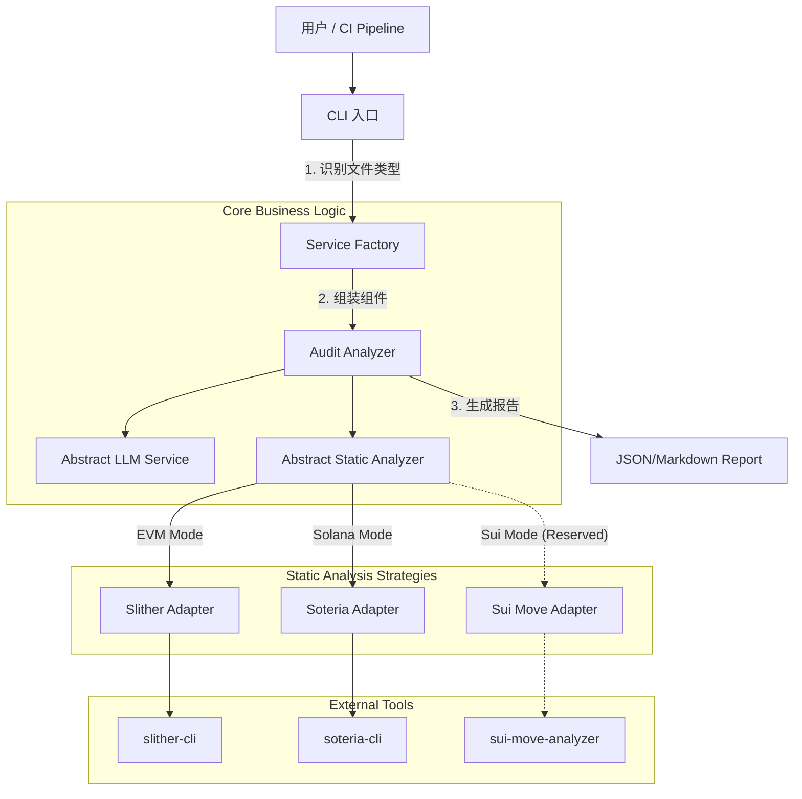

# 🛡️ Certi-Audit Agent v2.0

[](https://www.python.org/downloads/)
[](https://opensource.org/licenses/MIT)
[](https://github.com/psf/black)

**基于混合引擎 (Hybrid Engine) 与意图感知 (Intent-Aware) 的智能合约安全审计平台**

*支持 Ethereum (EVM), Solana, 并已为 Sui (Move) 架构就绪*

---

## 📖 项目简介

**Certi-Audit-Agent** 是一个 **“懂代码、懂业务、能实战”** 的智能合约安全审计 Agent。它突破了传统单一语言审计工具的限制，采用 **策略模式 (Strategy Pattern)** 构建了一个统一的安全分析框架。

本项目核心采用 **"Hybrid Analysis" (混合分析)** 机制，将传统静态分析工具的确定性与大语言模型 (LLM) 的推理能力完美结合：

- **静态分析层 (Fact Layer)**: 调用底层专用工具（Slither, Soteria 等）提取确定性漏洞事实，作为不可辩驳的“事实锚点”以减少漏报。
- **语义分析层 (Reasoning Layer)**: 利用 LLM (GPT-4o/Gemini/DeepSeek) 的语义理解能力，结合静态分析结果、业务意图描述与 RAG 知识库，输出具备业务上下文的修复建议，并能生成 PoC 代码。

## 🌟 核心特性 (v2.0 Highlights)

### 1. 🧠 混合分析引擎 (Hybrid Analysis Engine)
- **双重验证**: 结合 **Slither 静态分析** (数学/逻辑检查) 与 **LLM 语义分析** (业务逻辑/上下文理解)。
- **互补优势**: 静态层解决“漏报”，语义层解决“误报”，实现了安全检测的互补增强。

### 2. 🎯 业务意图识别 (Intent-Aware Auditing)
- **防止幻觉**: 允许通过 `--desc` 参数注入业务背景（如“这是一个不可转让的灵魂绑定代币”）。
- **精准判断**: AI 会根据你的意图来判断代码行为是否符合预期，而不是仅仅套用通用模板，有效规避了将“特殊业务逻辑”误判为“漏洞”的常见问题。

### 3. 🧩 智能依赖扁平化 (Dependency Flattening)
- **解决痛点**: 彻底解决 "Dependency Hell"。内置递归解析器，自动处理 Solidity 的 `import` 语句。
- **效果**: 将分散的合约文件（包括 OpenZeppelin 等库）合并为单文件上下文，让 LLM 能理解完整的继承链和跨合约逻辑，大幅提升准确度。

### 4. 💣 自动化 PoC 生成 (Auto-PoC)
- **实战导向**: 不仅仅指出漏洞，还能生成可执行的 **Foundry 测试用例** (`--poc`)，让开发者“眼见为实”。
- **闭环验证**: 实现从漏洞发现到实证攻击的闭环，极大提升了审计交付物的可信度。

### 5. ⛽ 多模式审计 (Multi-Mode)
- **SECURITY 模式**: 专注于挖掘重入、权限、溢出等安全漏洞。
- **GAS 模式**: 专注于 EVM 成本优化（存储布局、循环优化、Opcode 选择），提供具体的 Gas 节省估算。

### 6. 🛡️ 灵活部署与隐私保护
- **本地模型支持**: 完美支持 **Ollama** (Qwen2.5-Coder, DeepSeek)，代码不出本地，保障企业级隐私。
- **多链架构**: 支持 EVM (Solidity), Solana (Rust), 并预留 Sui (Move) 接口。

## 🏗️ 系统架构

采用了经典的 **策略模式** 与 **抽象工厂模式**，实现核心逻辑与底层工具链的解耦。



## 📂 项目结构

```plaintext
Certi-Audit-Agent/
├── config/                 # [配置层]
│   ├── settings.py         # 支持 PROJECT_TYPE 动态切换
│   ├── prompt_templates.py # Gas 优化和意图识别的 Prompt 模板
│   └── best_practices.txt  # RAG 知识库
├── core/                   # [业务层]
│   ├── factories.py        # [工厂] 负责 LLM 和 Analyzer 的装配
│   ├── analyzer.py         # [核心] 审计编排器 (含依赖扁平化逻辑)
│   └── pydantic_schema.py  # [Schema] 定义输出结构 (含 PoC 字段)
├── static_analyzers/       # [策略层] 核心解耦点
│   ├── abstract_analyzer.py# 定义标准分析行为 (Interface)
│   ├── slither_analyzer.py # EVM 实现
│   └── soteria_analyzer.py # Solana 实现
├── llm_services/           # [模型层]
│   ├── openai_service.py
│   ├── gemini_service.py
│   └── ollama_service.py   # 本地模型支持
├── main.py                 # [入口] 智能参数解析
└── requirements.txt
```

## 🚀 快速开始

### 1. 基础环境

- Python 3.10+
- Solc-select (EVM 必须)
- Rust Toolchain (Solana/Sui 必须)

### 2. 安装步骤

```bash
# 1. 克隆项目
git clone https://github.com/pluckhuang/certi-audit-agent.git
cd certi-audit-agent

# 2. 创建并激活虚拟环境 (推荐)
python3 -m venv venv
source venv/bin/activate  # Windows 用户使用: venv\Scripts\activate

# 3. 安装 Python 依赖
pip install -r requirements.txt

# 4. [EVM] 安装 Slither 及编译器管理工具
pip install slither-analyzer solc-select
solc-select install 0.8.0  # 安装目标合约所需的编译器版本
solc-select use 0.8.0

# 5. [Solana] 安装 Soteria (可选)
sh -c "$(curl -k https://supercompiler.xyz/install)"
```

### 3. 配置

复制 `.env.example` 为 `.env` 并填入 API Key。

```ini
# LLM 配置
LLM_MODEL_NAME=gemini-2.5-flash
# 或者使用本地模型
# LLM_MODEL_NAME=qwen2.5-coder
# LLM_API_KEY=ollama (本地模型随意填写)

# 自动检测，也可强制指定: EVM, SOLANA, SUI
PROJECT_TYPE=EVM 
```

## 🛠️ 使用指南

### 命令行参数详解

```bash
usage: main.py [-h] [--type {EVM,SOLANA,MOVE}] [--mode {SECURITY,GAS}] [--desc DESC] [--poc] [--output {CONSOLE,JSON,MARKDOWN}] file

positional arguments:
  file                  待审计的智能合约文件路径

options:
  -h, --help            show this help message and exit
  --type {EVM,SOLANA,MOVE}
                        覆盖项目类型
  --mode {SECURITY,GAS}
                        审计模式: SECURITY (默认) 或 GAS
  --desc DESC           业务逻辑描述 (强烈建议填写，防止误报)
  --poc                 开启 PoC 代码生成 (默认关闭)
  --output {CONSOLE,JSON,MARKDOWN}
                        输出格式
```

### 实战示例

**场景 A：审计一个复杂的 DeFi 合约，关注安全性**
注入业务背景，防止将“锁仓逻辑”误判为“蜜罐”。
```bash
python main.py target_contracts/evm/VulnerableToken.sol --mode SECURITY --desc "用户存入资产后，必须锁定7天才能提取" --output MARKDOWN
```

**场景 B：优化一个高频交易合约的 Gas**
```bash
python main.py target_contracts/evm/VulnerableToken.sol --mode GAS --output CONSOLE
```

**场景 C：审计 Solana 程序**
系统自动识别 `.rs` 后缀，加载 `SoteriaAnalyzer`。
```bash
python main.py programs/my_program/src/lib.rs
```

## 🔮 扩展指南：如何添加 Sui 支持？

由于本项目严格遵循 **开闭原则 (OCP)**，添加 Sui 支持无需修改核心逻辑，仅需三步：

1.  **实现适配器**： 在 `static_analyzers/` 下新建 `sui_analyzer.py`，继承 `AbstractStaticAnalyzer`，实现对 `sui move test` 或 `move-prover` 的调用。
2.  **注册工厂**： 在 `core/factories.py` 的 `_ANALYZER_REGISTRY` 中添加映射：`"SUI": SuiAnalyzer`。
3.  **更新知识库**： 在 `config/best_practices.txt` 中添加 Move 语言特有的 Object Ownership 安全原则。

## 📊 输出示例

```text
python main.py target_contracts/evm/VulnerableToken.sol
🚀 启动 Certi-Audit Agent...
📂 目标文件: target_contracts/evm/VulnerableToken.sol
🔧 审计模式: EVM
🏭 Factory: 根据模型名 'gemini-2.5-flash' 加载 -> create_gemini_service
🏭 Factory: 根据项目类型 'EVM' 加载 -> SlitherAnalyzer
🔍 [System] 正在运行静态分析 (模式: EVM)...
✅ [System] 静态分析完成。
   (摘要: ### 🔍 Slither 静态分析报告 (EVM): 1. [High] **reentrancy...)
🧠 [AI] 正在调用 gemini-2.5-flash 进行语义分析...

======================================================================
✅ 审计报告生成完成
======================================================================
**摘要:** 本次审计发现 `VulnerableToken` 合约存在一个高危的重入漏洞，主要原因是其 `withdraw` 函数未能遵循 Checks-Effects-Interactions (CEI) 安全模式。此外，合约使用了范围较广的 Solidity 编译器版本，存在低级调用，以及一个命名规范问题。作为语义补充，合约还缺少一个紧急暂停机制，这对于金融类合约而言是一个重要的安全最佳实践。

🔴 [漏洞 1] 重入漏洞 (Reentrancy) (High)
   📍 位置: Line 17
   📝 描述: 在 `withdraw` 函数中，外部调用 `msg.sender.call{value: _amount}("")` 发生在状态变量 `balances[msg.sender]` 更新之前。这违反了 Checks-Effects-Interactions (CEI) 模式。恶意合约可以利用此漏洞，在第一次提款的 Ether 到账后，立即再次调用 `withdraw` 函数，此时 `balances[msg.sender]` 尚未减少，导致攻击者可以多次提款，耗尽合约资金。
   🛠️ 建议: 严格遵循 Checks-Effects-Interactions (CEI) 模式。在进行任何外部调用之前，先更新合约的状态变量。或者，使用 ReentrancyGuard 模式来防止重入。
------------------------------
🔴 [漏洞 2] Solidity 编译器版本过旧/范围过广 (Informational)
   📍 位置: Line 2
   📝 描述: 合约使用了 `^0.8.0` 的编译器版本约束。这意味着合约可能使用任何 `0.8.x` 版本的编译器进行编译。某些旧的 `0.8.x` 版本已知存在编译器错误，可能导致意外行为或安全漏洞。建议锁定到一个特定的、经过充分测试的最新稳定版本。
   🛠️ 建议: 将 Solidity 编译器版本锁定到一个特定的、最新的稳定版本，例如 `0.8.20` 或更高版本，以避免潜在的编译器错误。
------------------------------
🔴 [漏洞 3] 缺少紧急暂停机制 (Medium)
   📍 位置: Line 17
   📝 描述: 合约缺乏一个紧急暂停机制，无法在发现漏洞或遭受攻击时暂停关键操作（如提款）。这可能导致在紧急情况下无法阻止资金流失，造成不可逆的损失。
   🛠️ 建议: 引入一个 `paused` 状态变量和一个仅限所有者调用的 `togglePause` 函数。在敏感函数（如 `withdraw`）中添加 `require(!paused, "Contract is paused")` 检查，以便在必要时暂停合约功能。
------------------------------
🔴 [漏洞 4] 低级调用 (Low-Level Call) (Informational)
   📍 位置: Line 22
   📝 描述: 在 `withdraw` 函数中使用了 `msg.sender.call{value: _amount}("")` 这种低级调用。低级调用虽然灵活，但绕过了 Solidity 的一些类型安全检查，如果使用不当，可能引入额外的复杂性和风险。在本合约中，它直接导致了重入漏洞。
   🛠️ 建议: 确保所有低级调用都经过严格的安全审查，并遵循 Checks-Effects-Interactions (CEI) 模式。对于简单的 Ether 转移，如果 gas 限制允许，可以考虑使用 `transfer()` 或 `send()`，它们提供了内置的重入保护（尽管有固定的 gas 限制）。
------------------------------
🔴 [漏洞 5] 命名规范违规 (Naming Convention Violation) (Informational)
   📍 位置: Line 17
   📝 描述: 在 `withdraw` 函数中，参数 `_amount` 的命名不符合 Solidity 推荐的 `mixedCase` 命名规范。虽然使用下划线前缀表示参数很常见，但 Slither 建议参数也应遵循 `mixedCase`。
   🛠️ 建议: 将参数 `_amount` 重命名为 `amount`，以符合 Solidity 的命名规范。
```
