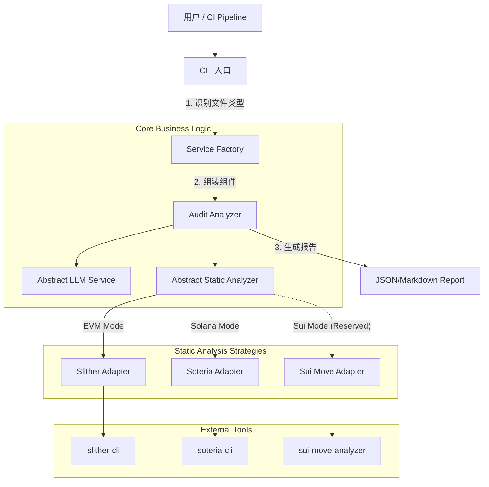

# 🛡️ Certi-Audit-Agent v1.0 (Multi-Chain Edition)

[](https://www.python.org/downloads/)
[](https://opensource.org/licenses/MIT)
[](https://github.com/psf/black)

**基于混合引擎 (Hybrid Engine) 的多链智能合约安全审计平台**
*支持 Ethereum (EVM), Solana, 并已为 Sui (Move) 架构就绪*

---

## 📖 项目简介

**Certi-Audit-Agent** 是一个区块链安全审计工具。它突破了传统单一语言审计工具的限制，采用 **策略模式 (Strategy Pattern)** 构建了一个统一的安全分析框架。

本项目核心采用 **"Hybrid Analysis" (混合分析)** 机制：

- **静态分析层 (Fact Layer)**: 调用底层专用工具（Slither, Soteria 等）提取确定性漏洞事实。
- **语义分析层 (Reasoning Layer)**: 利用 LLM (GPT-4o/Gemini) 的语义理解能力，结合静态分析结果与 RAG 知识库，输出具备业务上下文的修复建议。

## 🌟 核心特性

- **🔌 多链架构 (Multi-Chain Architecture)**:
    - **EVM (Solidity)**: 完整集成 Slither，支持 AST/CFG 级深度分析。
    - **Solana (Rust)**: 集成 Soteria 适配器，支持 Account 验证与签名检查。
    - **Sui (Move)**: Architecture Ready. 已预留 Move Prover 扩展接口。

- **🏭 自动化工厂 (Auto-Factory)**:
    - 基于文件后缀 (`.sol`, `.rs`, `.move`) 智能识别项目类型。
    - 通过依赖注入 (DI) 自动装配对应的分析器策略，无需修改核心代码。

- **🧠 混合动力引擎**: 将冷冰冰的代码报错转化为人类可读的、包含修复代码的结构化报告。

- **🛡️ 工程化落地**: 严格的 Pydantic Schema 校验、错误降级处理 (Graceful Degradation)、环境隔离配置。

## 🏗️ 系统架构

采用了经典的 **策略模式** 与 **抽象工厂模式**，实现核心逻辑与底层工具链的解耦。



## 📂 项目结构

```plaintext
Certi-Audit-Agent/
├── config/                 # [配置层]
│   ├── settings.py         # 支持 PROJECT_TYPE 动态切换
│   └── ...
├── core/                   # [业务层]
│   ├── factories.py        # [工厂] 负责 LLM 和 Analyzer 的装配
│   ├── analyzer.py         # [核心] 审计编排器 (依赖抽象接口)
│   └── ...
├── static_analyzers/       # [策略层] 核心解耦点
│   ├── abstract_analyzer.py# 定义标准分析行为 (Interface)
│   ├── slither_analyzer.py # EVM 实现
│   ├── soteria_analyzer.py # Solana 实现
│   └── sui_analyzer.py     # [TODO] Sui/Move 预留扩展
├── llm_services/           # [模型层]
│   ├── openai_service.py
│   └── gemini_service.py
├── main.py                 # [入口] 智能参数解析
└── requirements.txt
```

## 🚀 快速开始

### 1. 基础环境

- Python 3.10+
- Solc-select (EVM 必须)
- Rust Toolchain (Solana/Sui 必须)

### 2. 安装步骤 (按需)

```bash
# 1. 克隆项目
cd certi-audit-agent

# 2. 创建并激活虚拟环境 (推荐)
python3 -m venv venv
source venv/bin/activate  # Windows 用户使用: venv\Scripts\activate

# 3. 安装 Python 依赖
pip install -r requirements.txt

# [EVM] 安装 Slither
pip install slither-analyzer

# [Solana] 安装 Soteria (Linux/Mac)
sh -c "$(curl -k https://supercompiler.xyz/install)"

检测 Eth 合约需要配置 Solidity 编译器 (关键)
项目依赖 Slither 进行静态分析，Slither 需要与合约版本匹配的 solc 编译器。

# 安装 solc 版本管理工具 (如果 requirements.txt 中已安装，可跳过此行)
pip install solc-select

# 安装目标合约所需的编译器版本 (以 0.8.0 为例，对应 VulnerableToken.sol)
solc-select install 0.8.0

# 切换并激活该版本
solc-select use 0.8.0

如果计划审计 Solana 合约：

# 安装 Rust 工具链
curl --proto '=https' --tlsv1.2 -sSf https://sh.rustup.rs | sh

# 安装 Soteria 分析器
sh -c "$(curl -k https://supercompiler.xyz/install)"

```

### 3. 配置

复制 `.env.example` 为 `.env` 并填入 API Key。

```ini
# LLM 配置
LLM_MODEL_NAME=gemini-2.5-flash
# 自动检测，也可强制指定: EVM, SOLANA, SUI
PROJECT_TYPE=EVM 
```

## 🛠️ 使用指南

### 场景 A：审计 Ethereum 合约

系统自动识别 `.sol` 后缀，加载 `SlitherAnalyzer`。

```bash
python main.py contracts/VulnerableToken.sol
```

### 场景 B：审计 Solana 程序

系统自动识别 `.rs` 后缀，加载 `SoteriaAnalyzer`。

```bash
python main.py programs/my_program/src/lib.rs
```

### 场景 C：扩展 Sui (Move) 支持

虽然代码尚未完全实现，但可以通过命令行强制指定类型（需先实现适配器）。

```bash
python main.py sources/coin.move --type SUI
```

## 🔮 扩展指南：如何添加 Sui 支持？

由于本项目严格遵循 **开闭原则 (OCP)**，添加 Sui 支持无需修改核心逻辑，仅需三步：

1.  **实现适配器**： 在 `static_analyzers/` 下新建 `sui_analyzer.py`，继承 `AbstractStaticAnalyzer`，实现对 `sui move test` 或 `move-prover` 的调用。
2.  **注册工厂**： 在 `core/factories.py` 的 `_ANALYZER_REGISTRY` 中添加映射：
    ```python
    "SUI": SuiAnalyzer
    ```
3.  **更新知识库**： 在 `config/best_practices.txt` 中添加 Move 语言特有的 Object Ownership 安全原则。

## 📊 输出示例

```text
(venv) ➜  certi-audit-agent git:(main) ✗ python main.py target_contracts/evm/VulnerableToken.sol
🚀 启动 Certi-Audit Agent...
📂 目标文件: target_contracts/evm/VulnerableToken.sol
🔧 审计模式: EVM
🏭 Factory: 根据模型名 'gemini-2.5-flash' 加载 -> create_gemini_service
🏭 Factory: 根据项目类型 'EVM' 加载 -> SlitherAnalyzer
🔍 [System] 正在运行静态分析 (模式: EVM)...
✅ [System] 静态分析完成。
   (摘要: ### 🔍 Slither 静态分析报告 (EVM): 1. [High] **reentrancy...)
🧠 [AI] 正在调用 gemini-2.5-flash 进行语义分析...

======================================================================
✅ 审计报告生成完成
======================================================================
**摘要:** 本审计报告分析了 `VulnerableToken.sol` 智能合约。主要发现是一个高危的重入漏洞，该漏洞允许攻击者在单次提款操作中多次提取资金，从而耗尽合约余额。此外，还识别出编译器版本未固定、低级调用使用以及命名约定不一致等信息性问题。强烈建议立即修复重入漏洞，并遵循最佳实践以提高合约的整体安全性。

🔴 [漏洞 1] Reentrancy Vulnerability (High)
   📍 位置: Line 17
   📝 描述: 在 `withdraw` 函数中，外部调用 `msg.sender.call{value: _amount}("")` 发生在状态更新 `balances[msg.sender] -= _amount` 之前。这违反了 Checks-Effects-Interactions (CEI) 安全模式。恶意攻击者可以创建一个接收 Ether 的合约，并在其 fallback 或 receive 函数中重新调用 `withdraw` 函数。由于在第一次外部调用返回之前，攻击者的余额尚未减少，攻击者可以多次提取资金，直到合约被耗尽。
   🛠️ 建议: 遵循 Checks-Effects-Interactions (CEI) 模式。在进行任何外部调用之前，先更新合约状态。或者，可以使用 ReentrancyGuard 模式来防止重入。
------------------------------
🔴 [漏洞 2] Outdated/Floating Compiler Version (Informational)
   📍 位置: Line 2
   📝 描述: 合约使用了浮动的 Solidity 编译器版本 `^0.8.0`。浮动版本可能导致合约在不同编译器版本下编译出不同的字节码，并且可能在未来的版本中引入新的编译器错误。最佳实践是锁定到一个特定的、经过充分测试的编译器版本，以确保可预测性和安全性。
   🛠️ 建议: 将 Solidity 编译器版本锁定到一个特定的、稳定的版本，例如 `0.8.20`。
------------------------------
🔴 [漏洞 3] Low-Level Call Usage (Informational)
   📍 位置: Line 22
   📝 描述: 在 `withdraw` 函数中使用了低级 `call` 函数进行外部 Ether 传输。虽然 `call` 函数本身并非漏洞，但它绕过了 Solidity 的类型安全检查，并且在不当使用时（例如，在状态更新之前）是重入攻击的常见载体。此警告旨在提醒开发者在使用此类函数时需格外小心。
   🛠️ 建议: 确保低级调用遵循 Checks-Effects-Interactions (CEI) 模式，即在进行外部调用之前完成所有状态更新。此问题已通过重入漏洞的修复得到间接解决，确保了 `call` 的安全使用。
------------------------------
🔴 [漏洞 4] Naming Convention Violation (Informational)
   📍 位置: Line 17
   📝 描述: 函数参数 `_amount` 不符合 Solidity 命名约定。通常，函数参数应使用 `mixedCase` 格式，不带下划线前缀。下划线前缀通常用于内部或私有状态变量。
   🛠️ 建议: 将函数参数 `_amount` 重命名为 `amount`，以遵循 Solidity 命名约定。
```
